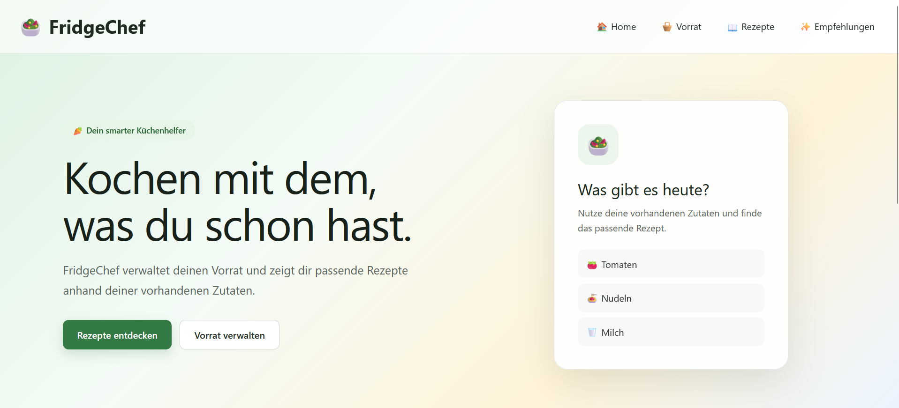
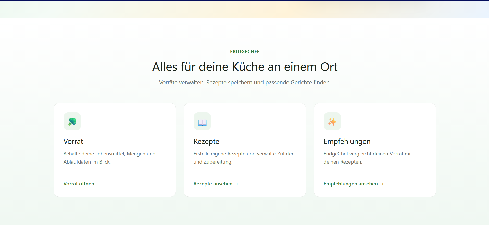
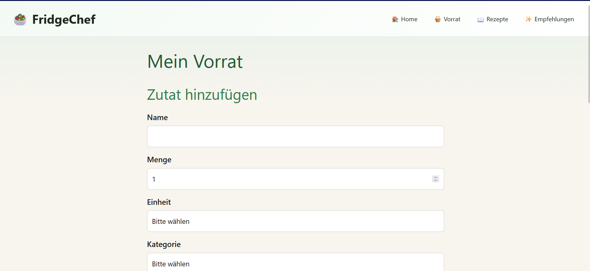
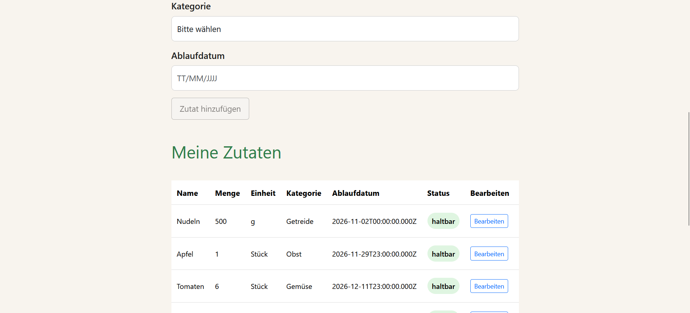
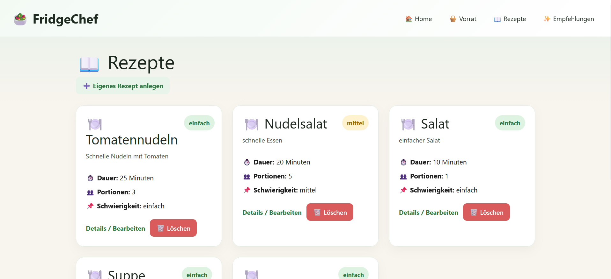
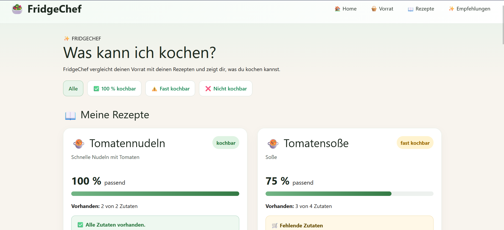
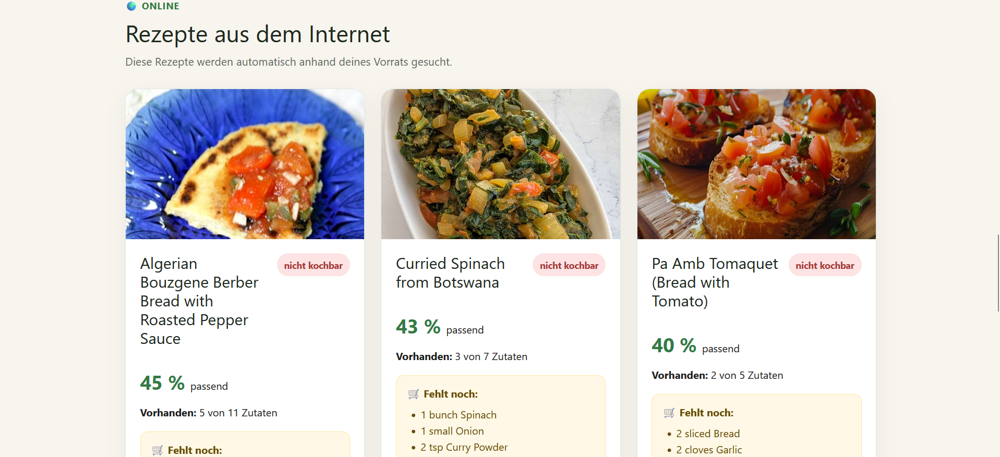
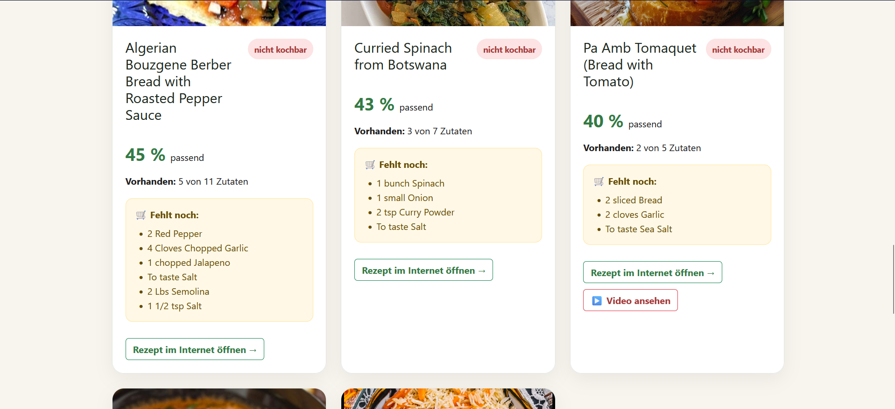

# FridgeChef Frontend

FridgeChef ist eine Webanwendung zur Verwaltung eines Lebensmittelvorrats und von Rezepten.

Die Anwendung unterstützt Nutzer dabei, den eigenen Vorrat zu verwalten und passende Rezepte zu finden.

Ein besonderes Feature ist die Matching-Funktion. Dabei werden die Zutaten eines Rezeptes mit den vorhandenen Zutaten im Vorrat verglichen.

Zusätzlich können automatisch Online-Rezepte geladen werden. Diese werden vom Backend über TheMealDB gesucht und anhand des aktuellen Vorrats bewertet.


## Funktionen

Das Frontend bietet:

- Navigation zwischen den Bereichen
- Vorratsverwaltung
- Zutaten hinzufügen
- Zutaten anzeigen
- Zutaten bearbeiten
- Zutaten löschen
- Formularvalidierung
- Ablaufstatus für Lebensmittel
- Rezeptverwaltung
- Rezepte anlegen
- Rezepte anzeigen
- Rezepte bearbeiten
- Rezepte löschen
- Rezeptdetailseite
- Anzeige von Zutaten und Zubereitungsschritten
- Empfehlungsseite „Was kann ich kochen?“
- Match-Prozent
- Status:
  - kochbar
  - fast kochbar
  - nicht kochbar
- Anzeige fehlender Zutaten
- Filter für Rezeptempfehlungen
- Sortierung nach Match-Prozent
- Hinweis auf bald ablaufende Zutaten
- automatische Online-Rezeptempfehlungen
- Laden externer Rezepte über das Backend
- Bilder für Online-Rezepte
- Match-Prozent für Online-Rezepte
- Anzeige fehlender Zutaten bei Online-Rezepten
- Links zu Originalrezepten
- Links zu Rezeptvideos, falls vorhanden
- Responsive Design
- Loading States
- Empty States
- Fehlermeldungen
- Sicherheitsabfragen beim Löschen


## Technologien

Für das Frontend werden verwendet:

- Angular
- TypeScript
- HTML
- CSS
- Reactive Forms
- Angular Router
- Fetch API
- Git
- GitHub
- Bootstrap 5

Die externen Rezeptdaten stammen aus TheMealDB und werden über das FridgeChef-Backend geladen.


## Voraussetzungen

Für die lokale Ausführung werden benötigt:

- Node.js
- npm
- Git
- laufendes FridgeChef-Backend

Das Backend muss standardmäßig unter folgender Adresse erreichbar sein:

```text
http://localhost:3000
```


## Installation

Repository klonen:

```bash
git clone https://github.com/Sabienas602518/fridgechef-frontend.git
```

In den Projektordner wechseln:

```bash
cd fridgechef-frontend
```

Abhängigkeiten installieren:

```bash
npm install
```

Frontend starten:

```bash
npm start
```

Alternativ:

```bash
ng serve
```

Falls PowerShell die Ausführung von `ng` blockiert, kann unter Windows auch verwendet werden:

```bash
ng.cmd serve
```

Anschließend ist die Anwendung erreichbar unter:

```text
http://localhost:4200
```


# Backend-Verbindung

Die Kommunikation mit dem Backend erfolgt über den `BackendService`.

Die Basisadresse lautet:

```text
http://localhost:3000/api
```

Beispiele für verwendete Endpunkte:

```text
/api/ingredients
/api/recipes
/api/matching/:recipeId
/api/online-recipes
```

Der `BackendService` bündelt die HTTP-Anfragen des Frontends.

Dadurch müssen die einzelnen Angular-Komponenten die Backend-Adressen nicht selbst verwalten.


# Seiten

## Home

Startseite der Anwendung.

```text
/
```

Die Startseite bietet einen Überblick über FridgeChef und Links zu den wichtigsten Bereichen.


## Vorrat

Verwaltung der vorhandenen Lebensmittel.

```text
/vorrat
```

Funktionen:

- Zutaten anzeigen
- Zutat hinzufügen
- Zutat bearbeiten
- Zutat löschen
- Ablaufdatum auswerten


## Vorrat-Detail

Detailansicht einer einzelnen Vorratszutat.

Hier können Daten einer vorhandenen Zutat angezeigt und bearbeitet werden.


## Rezepte

Übersicht aller selbst angelegten Rezepte.

```text
/rezepte
```


## Neues Rezept

Seite zum Erstellen eines neuen Rezeptes.

```text
/rezepte/neu
```


## Rezeptdetails

Detailansicht eines einzelnen Rezeptes.

```text
/rezepte/:id
```

Hier werden unter anderem angezeigt:

- Rezeptname
- Beschreibung
- Zutaten
- Mengen
- Einheiten
- Zubereitungsschritte
- weitere Rezeptinformationen

Das Rezept kann dort außerdem bearbeitet werden.


## Empfehlungen

```text
/empfehlungen
```

Die Empfehlungsseite zeigt passende Rezepte anhand des aktuellen Vorrats.

Die Seite besteht aus zwei Bereichen.


### Eigene Rezepte

Selbst angelegte FridgeChef-Rezepte werden mit dem aktuellen Vorrat verglichen.

Angezeigt werden unter anderem:

- Rezeptname
- Beschreibung
- Match-Prozent
- Kategorie
- vorhandene Zutaten
- fehlende Zutaten
- Fortschrittsbalken
- Hinweis auf bald ablaufende Zutaten

Es stehen Filter zur Verfügung für:

- alle
- 100 % kochbar
- fast kochbar
- nicht kochbar

Die Rezepte werden anhand des Match-Prozentwertes sortiert.


### Online-Rezepte

Zusätzlich werden automatisch Rezepte aus dem Internet geladen.

Das Frontend ruft dafür folgenden Backend-Endpunkt auf:

```text
GET /api/online-recipes
```

Das Backend sucht über TheMealDB nach Rezepten und vergleicht deren Zutaten mit dem aktuellen Vorrat.

Im Frontend werden unter anderem angezeigt:

- Rezeptname
- Rezeptbild
- Match-Prozent
- Kategorie
- Anzahl vorhandener Zutaten
- Anzahl benötigter Zutaten
- fehlende Zutaten
- Link zum Originalrezept
- Link zu einem Rezeptvideo, falls vorhanden


# Matching

Das eigentliche Matching wird im Backend berechnet.

Das Frontend erhält die berechneten Ergebnisse und stellt sie dar.


## Eigene Rezepte

Bei eigenen FridgeChef-Rezepten berücksichtigt das Backend:

- Name der Zutat
- Einheit
- benötigte Menge
- vorhandene Menge

Ein Ergebnis kann beispielsweise so aussehen:

```json
{
  "recipeName": "Tomatennudeln",
  "matchPercent": 100,
  "category": "kochbar"
}
```

Das Frontend nutzt diese Daten für:

- Sortierung
- Filter
- Statusanzeige
- Fortschrittsbalken
- Anzeige fehlender Zutaten


## Online-Rezepte

Bei Online-Rezepten wird ein vereinfachtes Matching verwendet.

Da externe Mengenangaben unterschiedlich formatiert sein können, wird hauptsächlich geprüft, ob eine benötigte Zutat im Vorrat vorhanden ist.

Das Frontend erhält vom Backend bereits den berechneten Match-Prozentwert und die Liste fehlender Zutaten.


# Ablaufdatum

Lebensmittel können anhand ihres Ablaufdatums eingeteilt werden in:

```text
abgelaufen
bald ablaufend
haltbar
```

Bald ablaufende Zutaten können zusätzlich bei passenden Rezepten hervorgehoben werden.

Die gemeinsame Ablauf-Logik befindet sich im Shared-Bereich in:

```text
src/app/shared/expiry.ts
```


# Loading States und Fehlerbehandlung

Beim Laden von Daten zeigt die Anwendung passende Ladezustände an.

Die Anwendung berücksichtigt unter anderem:

- Backend nicht erreichbar
- Online-Rezepte nicht erreichbar
- leere Listen
- ungültige Formulare
- fehlerhafte API-Anfragen
- Ladezustände
- Speicherzustände
- nicht vorhandene Daten

Für die Online-Rezepte existiert ein eigener Ladezustand und eine eigene Fehlermeldung.

Dadurch können die lokalen Empfehlungen weiterhin unabhängig von den Online-Rezepten verarbeitet werden.


# Responsive Design

Die Anwendung wurde für verschiedene Bildschirmgrößen gestaltet.

Unter anderem:

```text
Smartphone
Tablet
Desktop
```

Über Media Queries werden Navigation, Karten, Tabellen und Formulare an kleinere Bildschirmgrößen angepasst.

Die Online-Rezeptkarten werden auf kleineren Bildschirmen ebenfalls untereinander dargestellt.


# Projektstruktur

```text
fridgechef-frontend
├── screenshots
│   ├── home.png
│   ├── home2.png
│   ├── vorrat.png
│   ├── vorrat2.png
│   ├── rezept.png
│   ├── empfehlungen.png
│   └── empfehlungen2.png
├── src
│   └── app
│       ├── nav
│       ├── pages
│       │   ├── home
│       │   ├── vorrat
│       │   ├── vorrat-detail
│       │   ├── rezepte
│       │   ├── rezept-create
│       │   ├── rezept-detail
│       │   └── empfehlungen
│       ├── shared
│       │   ├── backend.ts
│       │   ├── expiry.ts
│       │   ├── ingredient.ts
│       │   ├── matching.ts
│       │   ├── online-recipe.ts
│       │   └── recipe.ts
│       └── app.routes.ts
├── angular.json
├── package.json
├── package-lock.json
└── README.md
```


# Wichtige Shared-Dateien

## backend.ts

Der `BackendService` enthält die Kommunikation mit dem Node.js-Backend.

Unter anderem werden dort Methoden verwendet für:

- Zutaten laden
- Zutaten erstellen
- Zutaten bearbeiten
- Zutaten löschen
- Rezepte laden
- Rezepte erstellen
- Rezepte bearbeiten
- Rezepte löschen
- Matching laden
- Online-Rezepte laden


## ingredient.ts

Definiert die TypeScript-Struktur einer Vorratszutat.


## recipe.ts

Definiert die TypeScript-Struktur eines Rezeptes und seiner Zutaten.


## matching.ts

Definiert die TypeScript-Strukturen für die Matching-Ergebnisse des Backends.


## online-recipe.ts

Definiert die TypeScript-Strukturen für Online-Rezepte.

Dazu gehören unter anderem:

- Rezept-ID
- Titel
- Bild
- Match-Prozent
- Kategorie
- Zutaten
- fehlende Zutaten
- Originalquelle
- YouTube-Link


## expiry.ts

Enthält gemeinsam verwendete Funktionen für die Auswertung von Ablaufdaten.

# Screenshots

## Startseite





## Vorrat





## Rezepte



## Empfehlungen







# Tests

Folgende User-Flows wurden während der Entwicklung geprüft:

1. Zutat anlegen
2. Zutat anzeigen
3. Zutat bearbeiten
4. Zutat löschen
5. Rezept anlegen
6. Rezept anzeigen
7. Rezept bearbeiten
8. Rezept löschen
9. Rezeptdetails anzeigen
10. Empfehlungen laden
11. Matching berechnen
12. Filter anwenden
13. fehlende Zutaten anzeigen
14. Ablaufstatus anzeigen
15. Responsive Design prüfen
16. Backend-Ausfall behandeln
17. ungültige Formulare behandeln
18. Online-Rezepte laden
19. Online-Matching anzeigen
20. fehlende Online-Zutaten anzeigen
21. externe Rezeptlinks prüfen
22. Verhalten bei nicht erreichbaren Online-Rezepten prüfen


## Automatisierte Tests

Die Angular-Tests können mit folgendem Befehl gestartet werden:

```bash
ng test
```


# Installation von Null

Die Installation wurde zusätzlich in einem separaten Testordner geprüft.

Dabei wurden:

- Backend frisch von GitHub geklont
- `npm install` ausgeführt
- `.env` neu angelegt
- Seed-Skript ausgeführt
- Backend gestartet
- Frontend frisch von GitHub geklont
- `npm install` ausgeführt
- Angular gestartet
- wichtige User-Flows getestet

Damit wurde geprüft, dass das Projekt auch außerhalb der ursprünglichen Entwicklungsumgebung gestartet werden kann.


# KI-Werkzeuge

 ChatGPT von OpenAI

Einsatzbereiche:


- Unterstützung bei der Fehlersuche
- Fragen zu Angular, TypeScript und JavaScript
- Erklärung von Compiler- und Runtime-Fehlern
- Unterstützung bei der Einbindung von Online-Rezepten über TheMealDB
- Testplanung
- Vorbereitung der Dokumentation


Die Vorschläge wurden in das eigene Projekt integriert, angepasst und praktisch getestet.


# Backend

Das Backend befindet sich in einem separaten Repository:

```text
fridgechef-backend
```

Repository:

```text
https://github.com/Sabienas602518/fridgechef-backend
```


# Autorin

Sabiena Jeyaragawan, 2026

FridgeChef